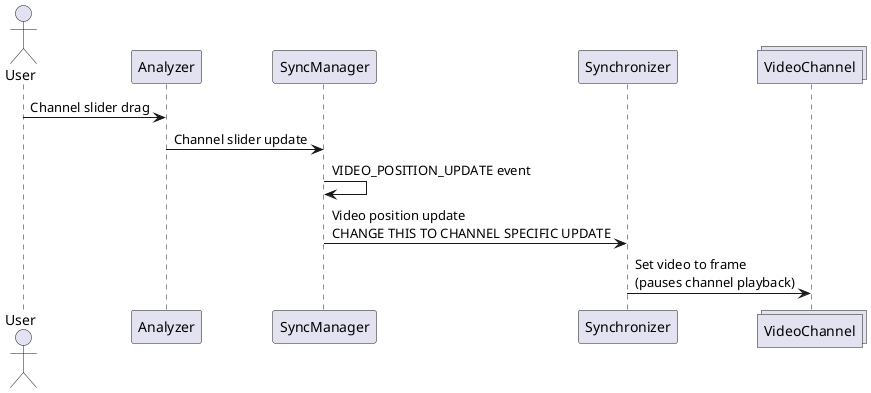
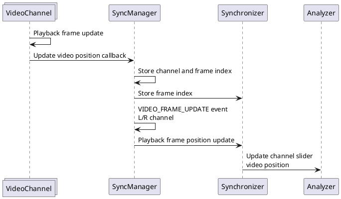
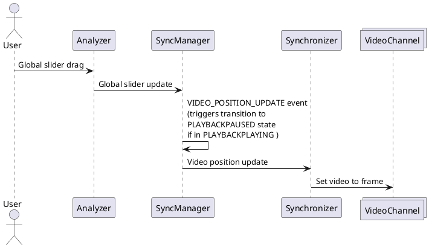
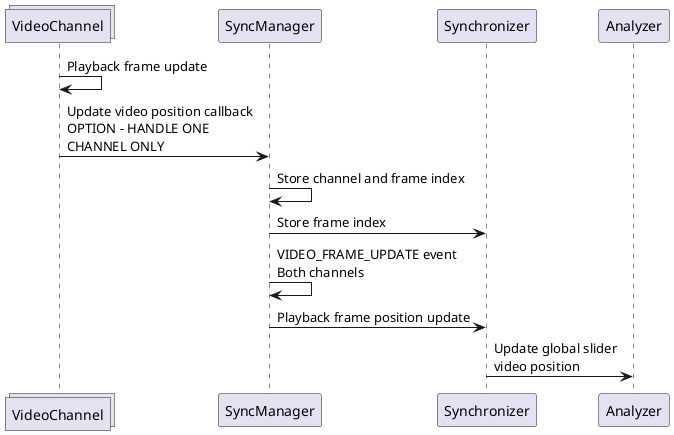

## Sync mode

### User drags channel scrollbar

```plantuml
@startuml

actor User
participant Analyzer
participant SyncManager
participant Synchronizer
collections VideoChannel

User -> Analyzer : Channel slider drag
Analyzer -> SyncManager : Channel slider update
SyncManager -> SyncManager : VIDEO_POSITION_UPDATE event
SyncManager -> Synchronizer : Video position update\nCHANGE THIS TO CHANNEL SPECIFIC UPDATE
Synchronizer -> VideoChannel : Set video to frame\n(pauses channel playback)

@enduml
```

### Video frame update triggers scrollbar update

```plantuml
@startuml

collections VideoChannel
participant SyncManager
participant Synchronizer
participant Analyzer

VideoChannel -> VideoChannel : Playback frame update
VideoChannel -> SyncManager : Update video position callback
SyncManager -> SyncManager : Store channel and frame index
SyncManager -> Synchronizer : Store frame index
SyncManager -> SyncManager : VIDEO_FRAME_UPDATE event\nL/R channel
SyncManager -> Synchronizer : Playback frame position update
Synchronizer -> Analyzer : Update channel slider\nvideo position

@enduml
```

## Playback mode

### User drags joint scrollbar

```plantuml
@startuml

actor User
participant Analyzer
participant SyncManager
participant Synchronizer
collections VideoChannel

User -> Analyzer : Global slider drag
Analyzer -> SyncManager : Global slider update
SyncManager -> SyncManager : VIDEO_POSITION_UPDATE event\n(triggers transition to\nPLAYBACKPAUSED state\nif in PLAYBACKPLAYING )
SyncManager -> Synchronizer : Video position update
Synchronizer -> VideoChannel : Set video to frame

@enduml
```

### Update joint scrollbar during playback

```plantuml
@startuml

collections VideoChannel
participant SyncManager
participant Synchronizer
participant Analyzer

VideoChannel -> VideoChannel : Playback frame update
VideoChannel -> SyncManager : Update video position callback\nOPTION - HANDLE ONE\nCHANNEL ONLY
SyncManager -> SyncManager : Store channel and frame index
SyncManager -> Synchronizer : Store frame index
SyncManager -> SyncManager : VIDEO_FRAME_UPDATE event\nBoth channels
SyncManager -> Synchronizer : Playback frame position update
Synchronizer -> Analyzer : Update global slider\nvideo position

@enduml
```
